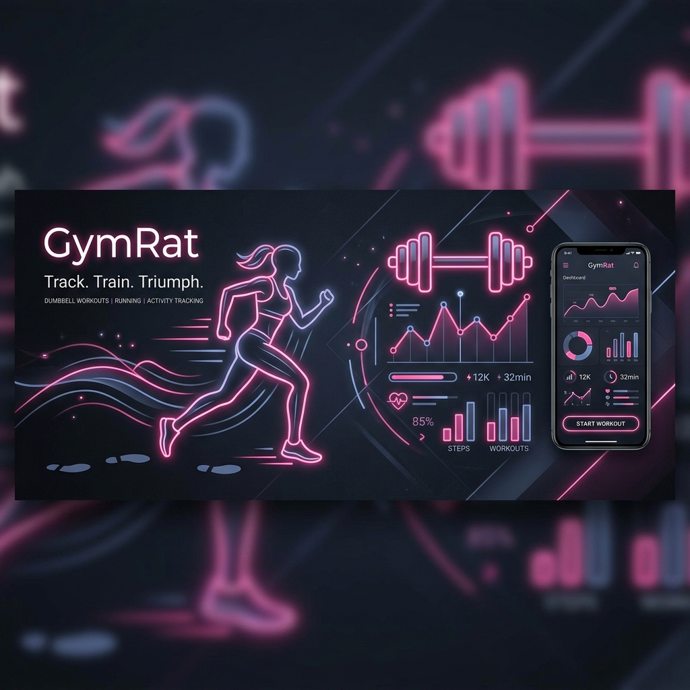

# GymRat 🏋️‍♂️



> **Track. Train. Triumph.**
> GymRat (styled as **FitFlow** in-app) is a premium, feature-rich fitness companion and activity tracking mobile application built with React Native and Expo. It provides users with an elegant interface to explore workouts, learn proper form through high-quality video demonstrations, bookmark their favorite exercises, and log daily activity metrics (steps & calories) using native hardware sensors.

---

## 📖 Table of Contents

- [Key Features](#-key-features)
- [Tech Stack](#-tech-stack)
- [Screens Walkthrough](#-screens-walkthrough)
- [Project Architecture & Component Highlights](#-project-architecture--component-highlights)
- [Directory Layout](#-directory-layout)
- [Getting Started & Installation](#-getting-started--installation)
- [Permissions & Configurations](#-permissions--configurations)
- [Future Roadmap](#-future-roadmap)

---

## ✨ Key Features

1. **🏋️‍♂️ Rich Exercise Encyclopedia**
   - Interactive database of over 100 exercises spanning all major muscle groups: *Chest, Back, Shoulders, Biceps, Triceps, Legs, and Core*.
   - Instant search capability filterable by muscle groups or equipment type.
2. **📹 Immersive Video Demonstrations**
   - Multi-source media players built directly into details modals.
   - Dynamically checks for local MP4 files (e.g., Squats, Bench Press, Pull-ups) utilizing `expo-video` or loads relevant YouTube tutorials via `react-native-youtube-iframe` with intelligent URL parsing.
3. **🏃‍♂️ Daily Activity & Step Tracker**
   - Real-time hardware step-counting using the native `expo-sensors` Pedometer API.
   - Automatically stores steps locally using `AsyncStorage` and visualizes a 7-day progress chart.
   - Dynamic calorie burn estimation calculated at `0.04 kcal per step`.
4. **💖 Personalized Workouts (Favorites)**
   - Star exercises to build your custom workout menu. Saved states are persistent.
   - Custom spring-animated visual feedback on favorite toggles.
5. **⚡ Daily Motivation Hub**
   - Connects to the public API `zenquotes.io` on startup to fetch daily inspiration quotes, falling back gracefully to offline quotes if network connection is missing.
6. **🤖 Stylized Loader Animation**
   - High-fidelity custom [BenchPressLoader.js](file:///Users/kush/GymRat/components/BenchPressLoader.js) showing a stylized lifter performing bench press repetitions using custom native CSS translations.

---

## 🛠 Tech Stack

- **Core & Runtime**: [React Native v0.81.5](https://reactnative.dev/) with [Expo SDK 54 (~54.0.20)](https://expo.dev/)
- **Navigation**: [@react-navigation/native v7](https://reactnavigation.org/) (Native-Stack Stack Navigator)
- **Local Persistence**: [@react-native-async-storage/async-storage v2.2.0](https://github.com/react-native-async-storage/async-storage)
- **Native Hardware APIs**: `expo-sensors` (Pedometer integration)
- **Media Playback**: `expo-video` & `react-native-youtube-iframe`
- **Styling & Layout**: StyleSheet (Flexbox architecture)
- **Animations**: React Native Animated API (Easing, Timing, Spring hooks), Reanimated

---

## 📱 Screens Walkthrough

### 🏠 Home Screen — [HomeScreen.js](file:///Users/kush/GymRat/screens/HomeScreen.js)
The entry point features a high-impact background slideshow that fades dynamically between high-quality training photography. Includes:
- A customizable header showing shortcuts to bookmarked exercises.
- Motivational quote card fetched from `zenquotes.io`.
- Step tracker banner summarizing current activity progress.
- Easy navigation triggers for exploring workouts.

### 🔍 Explore Exercises — [ExerciseListScreen.js](file:///Users/kush/GymRat/screens/ExerciseListScreen.js)
Displays the full workout catalog inside a performance-optimized `FlatList` grid. Features:
- Horizontal scrolling muscle-group chips to filter list instantly.
- Live search input matching exercise names.
- Simulated premium skeleton load times powered by the custom weightlifting loader.

### 📋 Exercise Detail — [ExerciseDetailScreen.js](file:///Users/kush/GymRat/screens/ExerciseDetailScreen.js)
Provides step-by-step guidance on how to perform the movement safely:
- Bolded and styled instructions parser for readability.
- Playback modal wrapper supporting YouTube video streaming and native offline asset playback.
- Favorite toggle with spring scale physics.
- "Mark as Done" action logger.

### 👣 Step Tracker — [StepTrackerScreen.js](file:///Users/kush/GymRat/screens/StepTrackerScreen.js)
A dedicated health dashboard tracking daily steps:
- Real-time sensor listener updating step counts.
- Circular progress bar tracking user progress against a `10,000 steps daily goal`.
- Calories burned calculator card.
- 7-day custom-designed interactive bar chart highlighting daily step counts.
- Data reset tool to clean historical states.

### ❤️ Saved Exercises — [FavoritesScreen.js](file:///Users/kush/GymRat/screens/FavoritesScreen.js)
Aggregates all favorited exercises. Feeds from keys matching `@fav_*` via `AsyncStorage` and renders them in a lightweight 2-column grid.

---

## ⚡ Project Architecture & Component Highlights

### 🏋️‍♂️ Custom Weightlifter Loader: [BenchPressLoader.js](file:///Users/kush/GymRat/components/BenchPressLoader.js)
Instead of standard loading spinners, GymRat displays a custom-coded SVG/CSS style animation. It uses the `Animated` API to loop a barbell up and down relative to a head/torso layout, mimicking a realistic bench press rep cadence:
```javascript
const benchPress = Animated.sequence([
  Animated.timing(barbellY, {
    toValue: 20,
    duration: 800,
    easing: Easing.inOut(Easing.ease),
    useNativeDriver: true,
  }),
  Animated.delay(80),
  Animated.timing(barbellY, {
    toValue: 0,
    duration: 500,
    easing: Easing.out(Easing.ease),
    useNativeDriver: true,
  }),
  Animated.delay(350),
]);
Animated.loop(benchPress).start();
```

### 👣 Sensor Integration: [StepTrackerScreen.js](file:///Users/kush/GymRat/screens/StepTrackerScreen.js)
The app hooks directly into native sensors via Expo Pedometer:
- **iOS**: Uses `CoreMotion` library.
- **Android**: Demands `android.permission.ACTIVITY_RECOGNITION`.
Checks availability asynchronously, queries today's historical steps from midnight to the current timestamp, and initializes a live listener subscription:
```javascript
subscription = Pedometer.watchStepCount((result) => {
  setCurrentSteps((prev) => prev + result.steps);
});
```

---

## 📂 Directory Layout

```text
GymRat/
├── .expo/                   # Expo configuration cache
├── assets/                  # App images, video files & branding
│   ├── images/              # Banner images & exercise cards
│   ├── videos/              # Local high-quality MP4 exercise demonstrations
│   └── gymrat_banner.png    # App README Banner (generated)
├── components/              # Shared reusable components
│   ├── BenchPressLoader.js  # Stylized custom loading screen
│   ├── ExerciseCard.js      # Individual grid card item for exercises
│   └── Header.js            # Universal App Header
├── data/                    # Hardcoded database scripts
│   ├── Excercises.js        # Main exercise list with detailed descriptions
│   └── videoReferences.js   # Alternate media source catalog with Web URLs
├── screens/                 # Mobile Screen Layouts
│   ├── HomeScreen.js        # Dashboard, quote board & menu
│   ├── ExerciseListScreen.js# Exercise list with chips filters
│   ├── ExerciseDetailScreen.js# Step-by-step guides & video modal
│   ├── StepTrackerScreen.js # Sensor tracker & weekly chart
│   └── FavoritesScreen.js   # Bookmarked routines list
├── App.js                   # Application Routing and Stack Navigator setup
├── app.json                 # Expo system metadata, plugins & permission config
├── eas.json                 # Cloud build configuration profiles
├── index.js                 # App Entry Point registration
├── package.json             # JS Dependencies and scripting
└── README.md                # Project Documentation (You are here!)
```

---

## 🚀 Getting Started & Installation

Follow these steps to set up the project locally:

### 1. Prerequisites
- **Node.js**: Ensure you have Node.js installed (LTS recommended).
- **Expo Go App**: Download the Expo Go application on your mobile device (App Store / Google Play) to preview live updates, or prepare iOS Simulator/Android Emulator configs.

### 2. Install Dependencies
Navigate to the root directory of your project and install the packages:
```bash
npm install
```

### 3. Run Development Server
Start the Metro Bundler:
```bash
npm start
# OR
npx expo start
```
Scan the QR code displayed in your terminal using the Expo Go app or your camera.

### 4. Running Native Builds
To run directly inside simulated environments:
*   **iOS Simulator**:
    ```bash
    npm run ios
    ```
*   **Android Emulator**:
    ```bash
    npm run android
    ```
*   **Web Sandbox**:
    ```bash
    npm run web
    ```

---

## 🔒 Permissions & Configurations

The step counter functions depend on system-level hardware modules. The following keys are configured in [app.json](file:///Users/kush/GymRat/app.json):

### iOS
Requires `NSMotionUsageDescription` in `infoPlist` to access the motion coprocessor:
```json
"ios": {
  "supportsTablet": true,
  "bundleIdentifier": "com.kush2005.GymRat",
  "infoPlist": {
    "ITSAppUsesNonExemptEncryption": false,
    "NSMotionUsageDescription": "GymRat uses motion data to count your steps."
  }
}
```

### Android
Requires standard permissions inside the Android manifest:
```json
"android": {
  "package": "com.kush2005.GymRat",
  "permissions": [
    "android.permission.ACTIVITY_RECOGNITION"
  ]
}
```

---

## 🗺 Future Roadmap

- [ ] **Custom Workouts**: Enable users to create, label, and order custom exercise sessions.
- [ ] **Advanced Analytics**: Integrate charts for body weight, muscle progression, and calorie tracker charts over months.
- [ ] **Wearable Integration**: Integrate smartwatches (Apple Watch & Google Fit/Samsung Health WearOS).
- [ ] **Voice Coach**: Add text-to-speech audio guides talking through instructions while workouts are active.

---

*Made with ❤️ by Kush. Happy training!* 💪
