<div align="center">


# GymRat

**A local-first fitness companion built with React Native, Expo, and JavaScript.**
Workout logging with automatic PR tracking, real step/health data from Apple Health & Health Connect with a three-tier fallback chain, and a nutrition engine built on the Mifflin–St Jeor equation and ISSN protein research — all stored on-device with zero backend.

[](https://reactnative.dev)
[](https://expo.dev)
[](https://developer.mozilla.org/docs/Web/JavaScript)
[](https://www.sqlite.org)
[](#-getting-started)

</div>

---

## Screenshots

<table>
  <tr>
    <td align="center">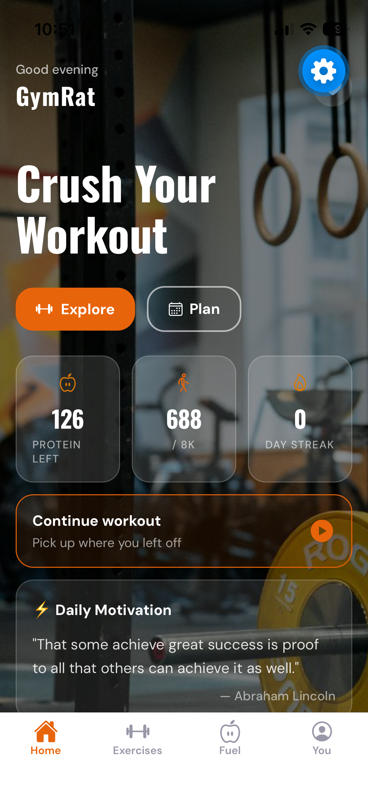<br/><b>Home</b></td>
    <td align="center">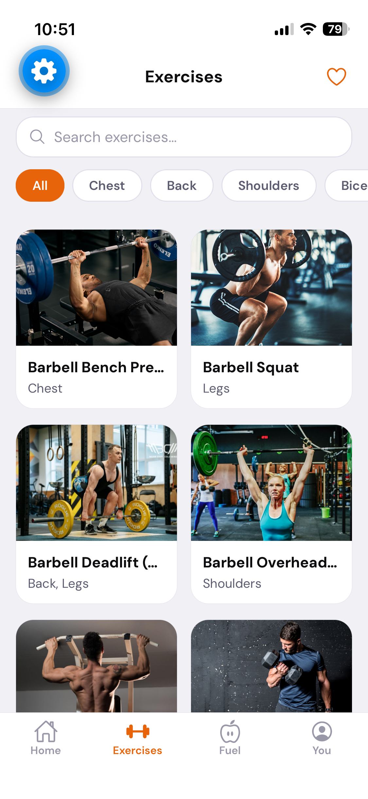<br/><b>Exercise Library</b></td>
    <td align="center">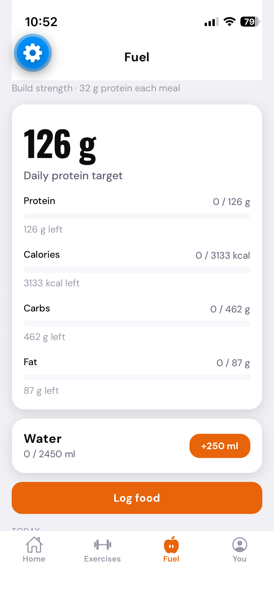<br/><b>Fuel — Nutrition</b></td>
  </tr>
  <tr>
    <td align="center">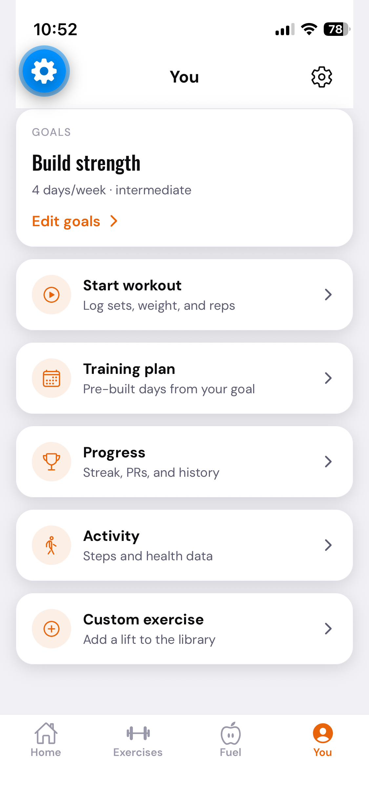<br/><b>You — Hub</b></td>
    <td align="center">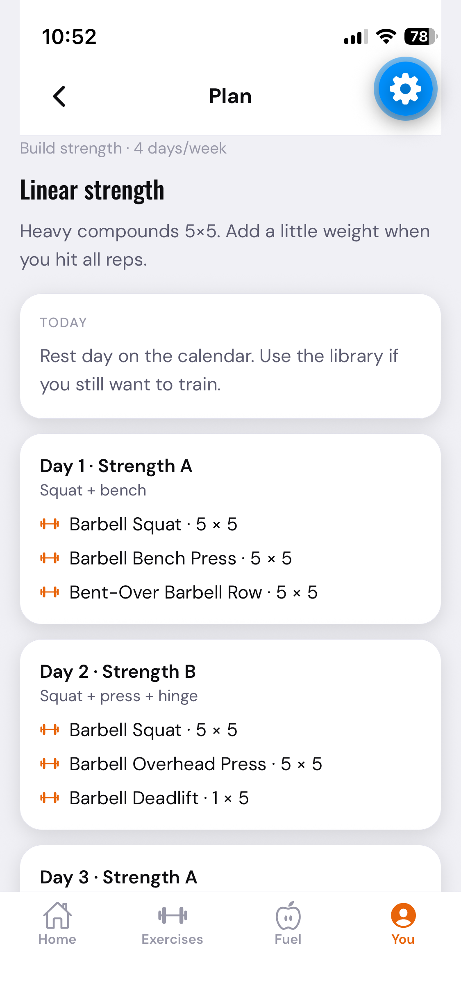<br/><b>Training Plan</b></td>
    <td align="center">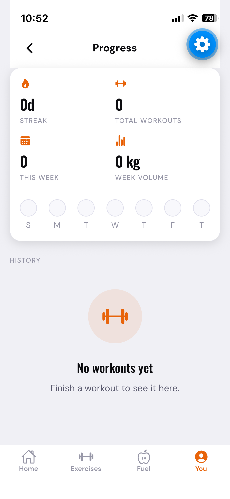<br/><b>Progress & PRs</b></td>
  </tr>
  <tr>
    <td align="center">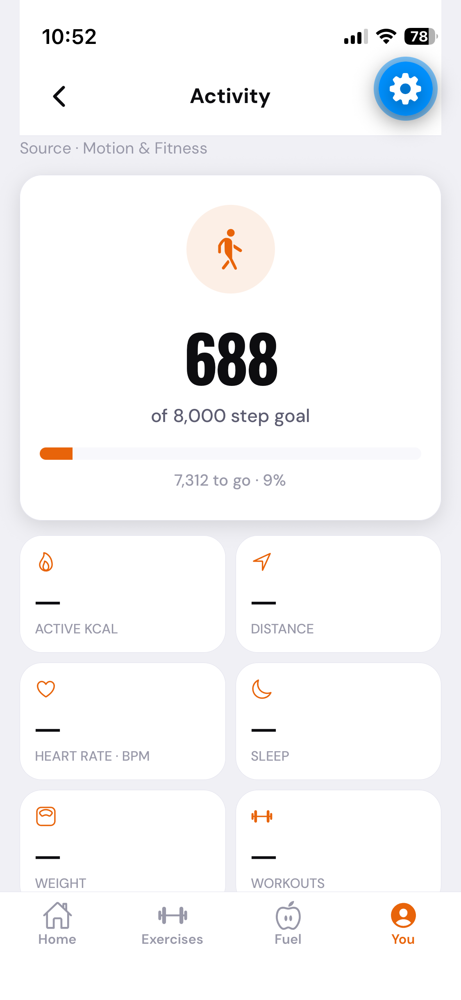<br/><b>Activity Tracking</b></td>
    <td align="center">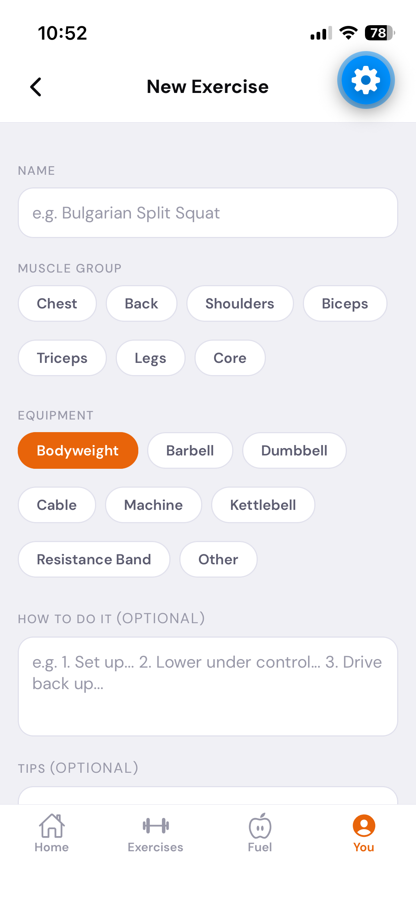<br/><b>Custom Exercise</b></td>
    <td align="center">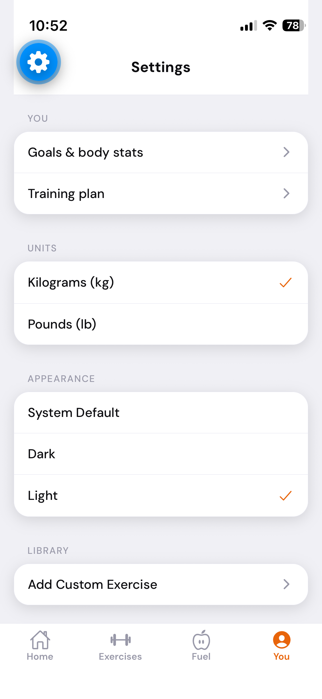<br/><b>Settings</b></td>
  </tr>
</table>

---

## Table of Contents

1. [Overview](#overview)
2. [Tech Stack](#tech-stack)
3. [Features](#features)
   - [Workout Logger with Automatic PR Tracking](#1-workout-logger-with-automatic-pr-tracking)
   - [Exercise Library](#2-exercise-library-97-exercises)
   - [Health & Activity Tracking](#3-health--activity-tracking)
   - [Evidence-Based Nutrition Engine](#4-evidence-based-nutrition-engine)
   - [Adaptive Training Plans](#5-adaptive-training-plans)
   - [Onboarding & Personalization](#6-onboarding--personalization)
   - [Design System](#7-design-system)
   - [Local-First Data Layer](#8-local-first-data-layer)
4. [Architecture](#architecture)
5. [Data Flow Walkthroughs](#data-flow-walkthroughs)
6. [Folder Structure](#folder-structure)
7. [Getting Started](#-getting-started)
8. [Permissions & Health Data](#-permissions--health-data)
9. [Engineering Decisions](#engineering-decisions)
10. [Roadmap](#-roadmap)

---

## Overview

GymRat is a fitness app that treats the phone as the entire backend. There's no server, no auth flow, no cloud sync — every workout, meal log, favorite, and health snapshot is written straight to an on-device SQLite database the moment it happens. That constraint shaped most of the interesting engineering in this repo: a **provider-abstraction layer** that safely talks to two entirely different native health APIs (Apple HealthKit and Android Health Connect) with a shared interface and a universal sensor fallback; a **repository pattern** wrapping every table behind a typed, synchronous API; and a **deliberately simplified workout-logging model** designed after watching how people actually behave in a gym (they don't want to fill in a form for every set — see [§1](#1-workout-logger-with-automatic-pr-tracking) for why).

The app is organized around four tabs — **Home**, **Exercises**, **Fuel**, and **You** — backed by a 97-exercise library with verified video demonstrations, a 104-item food database spanning Western and Indian staples, and a nutrition engine that computes calorie/protein/macro targets from real physiology formulas (Mifflin–St Jeor BMR, ISSN protein ranges) instead of guessing a round number.

---

## Tech Stack

| Layer | Technology | Why |
|---|---|---|
| **Framework** | React Native 0.86 · Expo SDK 57 · JavaScript (ES modules) | Managed workflow with config plugins for the two native health SDKs, without ejecting |
| **Navigation** | React Navigation 7 — one root stack gating onboarding, four bottom tabs, each with its own native stack | Deep, typed navigation graphs with cross-stack screen reuse (see [Architecture](#architecture)) |
| **Local persistence** | `expo-sqlite` (WAL journal mode, foreign keys on) | Real relational storage on-device — no AsyncStorage key/value hacks, no backend |
| **Health integration** | `react-native-health-connect` (Android) · `@kingstinct/react-native-healthkit` (iOS) · `expo-sensors` `Pedometer` (universal fallback) | A `HealthProvider` interface abstracts all three behind one contract |
| **Fonts** | `@expo-google-fonts/oswald` + `@expo-google-fonts/dm-sans` | Display/body type pairing used consistently across the design system |
| **Media** | `expo-video` | Native exercise-demo video playback for bundled clips |
| **Sharing / Export** | `expo-sharing`, `expo-file-system`, React Native's core `Share` API | JSON data export and native "share your win" for workout summaries |
| **Haptics** | `expo-haptics` | Feedback on favoriting and hitting a new personal record |
| **Build & Deploy** | EAS Build, EAS Update, a custom Expo config plugin (`plugins/withHealthConnectQueries.js`) | Injects the Android manifest `<queries>` entry Health Connect requires to be detectable |

---

## Features

### 1. Workout Logger with Automatic PR Tracking

**Files:** [`src/db/workoutRepo.js`](src/db/workoutRepo.js) · [`src/screens/workout/ActiveWorkoutScreen.js`](src/screens/workout/ActiveWorkoutScreen.js) · [`WorkoutSummaryScreen.js`](src/screens/workout/WorkoutSummaryScreen.js) · [`WorkoutHistoryScreen.js`](src/screens/workout/WorkoutHistoryScreen.js)

Most workout loggers model a session as sets-within-exercises-within-workouts and ask for weight and reps on every single set. GymRat deliberately doesn't: **each exercise gets exactly one entry per session — your best effort for that movement today.** That's a product decision, not a limitation: the schema (`workout_sessions → workout_exercises → sets`) still supports multiple sets per exercise, but the UI and the `logSet()` upsert method treat it as one slot, because the friction of a full set-by-set form is what makes people stop logging.

- **PR detection is a single SQL query, not client-side bookkeeping.** `getPR(exerciseId)` joins `sets → workout_exercises → workout_sessions`, filters to `completed = 1 AND finished_at IS NOT NULL`, and orders by `weight_kg DESC, reps DESC LIMIT 1`. Because it requires a *finished* session, a workout still in progress is automatically excluded — so comparing today's typed value against `getPR()` is always a fair comparison against real history, with no manual "snapshot before you start" step.
- **Live feedback, not post-save feedback.** `ActiveWorkoutScreen`'s `ExerciseLogRow` derives `beatsPR` from the *currently typed* weight/reps state on every keystroke (not the last committed value), so the card's border, an animated "New PR!" badge (`Animated.spring`), and a success haptic all fire the instant you type a number that beats your best — before you even tab to the next field. A `useRef` tracks the previous frame's boolean so the haptic only fires on the rising edge, not on every render.
- **Streaks and weekly volume are computed in `getProgressStats()`**: a single SQL aggregate pulls this week's session/set/volume/duration totals, then a small JS loop walks backward day-by-day from today against a `Set` of "trained" date keys (built from `date(finished_at/1000,'unixepoch','localtime')`) to compute the current streak — stopping the moment a day is missed.
- **Grouped by muscle, not by add-order.** The log groups exercises by body part client-side, cross-referencing each `exercise_id` against the exercise library (`getAllExercises()`), so "what did I train today" is visible at a glance without a separate query.
- **Milestones and sharing.** Finishing a session checks the fresh `totalWorkouts`/`streak` against fixed milestone tables (1/5/10/25/50/100+ workouts, 3/7/14/30+ day streaks) and, on a new PR, offers a one-tap native share sheet (`Share.share`) with a generated summary line.
- **"Repeat last workout"** (`repeatLastWorkout()`) seeds a new session with the previous session's exercises pre-filled at their last logged weight/reps, so a repeat day is a glance-and-confirm instead of re-typing everything.

### 2. Exercise Library (97 exercises)

**Files:** [`src/data/exercisesData.js`](src/data/exercisesData.js) · [`src/data/exercises.js`](src/data/exercises.js) · [`src/components/ExerciseCard.js`](src/components/ExerciseCard.js) · [`src/screens/exercises/`](src/screens/exercises)

37 exercises ship with bundled local images and a curated demo video; the other 60 (added to properly cover shoulders, arms, posterior chain, and conditioning) use **YouTube's own public thumbnail CDN** (`img.youtube.com/vi/<id>/hqdefault.jpg`) as their card image, paired with a link to the exact video that thumbnail belongs to. Every one of those 60 links was individually verified to exist and match the exercise before being added — for something safety-relevant like lifting form, a wrong or dead video is worse than no video.

- **Search + muscle-group filtering** (`filterExercises()`) handles compound body parts (e.g. `"Back, Legs"` for a deadlift) by splitting on comma, so an exercise can surface under more than one filter chip.
- **Custom exercises** (`src/db/customExerciseRepo.js`) are stored in their own table with optional user-written instructions/tips, then merged transparently into the same list via `getAllExercises()` — the rest of the app (search, favorites, the workout logger's exercise picker) never has to know whether an exercise is bundled or user-created.
- **Favorites are stored as a JSON snapshot**, not a foreign key (`favoritesRepo.add()` serializes the whole `Exercise` object into a `data` column). That's deliberate: a favorited custom exercise still renders correctly even if the user later edits or deletes the original custom-exercise row.

### 3. Health & Activity Tracking

**Files:** [`src/health/`](src/health) (`types.js`, `client.js`, `androidHealthConnect.js`, `iosHealthKit.js`, `pedometer.js`, `env.js`) · [`src/hooks/useHealth.js`](src/hooks/useHealth.js) · [`src/screens/activity/StepTrackerScreen.js`](src/screens/activity/StepTrackerScreen.js)

This is the most architecturally involved part of the app: two unrelated native health SDKs, one shared UI, and a client that has to behave correctly whether it's running in Expo Go, a dev client, or a production build.

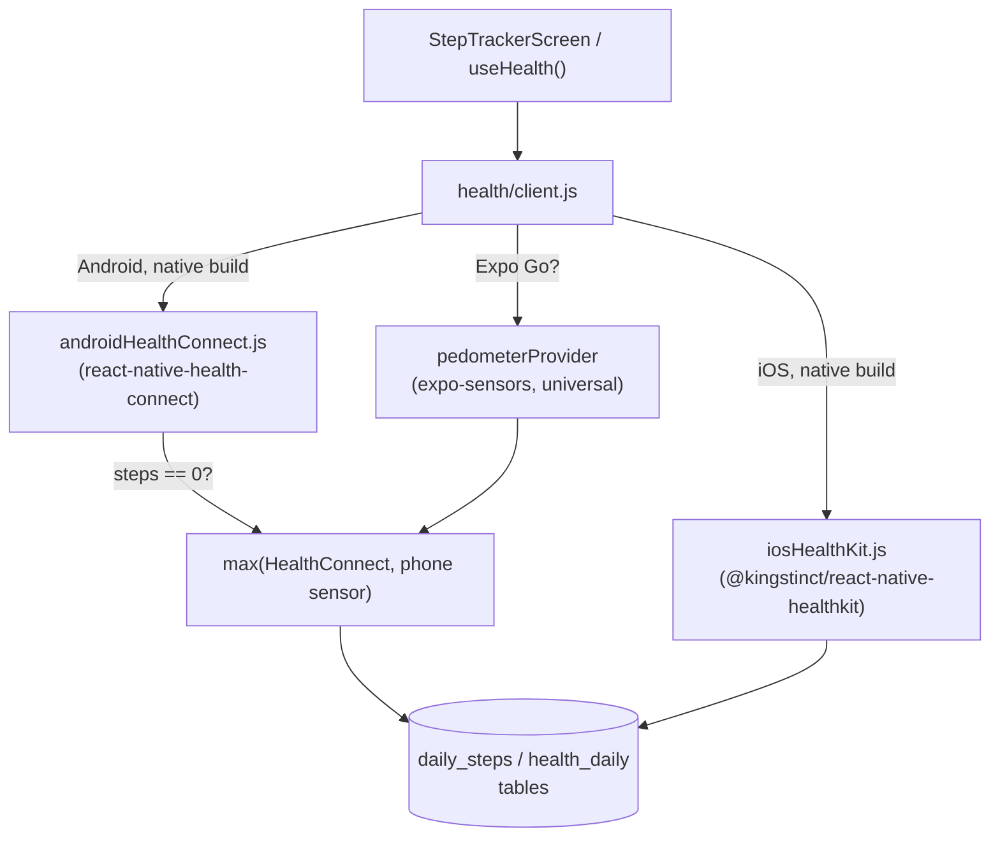

- **One interface, three implementations.** `HealthProvider` (`getStatus`, `request`, `readToday`, optional `openSettings`) is implemented independently by `androidHealthConnect`, `iosHealthKit`, and `pedometerProvider`. `health/client.js` picks the right one at runtime and everything above it (the hook, the screen) is written against the interface, never the implementation.
- **Native modules are loaded lazily and defensively.** `loadNative()` checks `isExpoGo()` (via `Constants.executionEnvironment`/`appOwnership`) before ever `import()`-ing the platform module — Health Connect and HealthKit are compiled native code that simply isn't present in the generic Expo Go binary, so attempting to load them there would crash the app. In Expo Go, the client transparently falls back to `expo-sensors`' `Pedometer`, which *is* available everywhere.
- **A full permission state machine**, not a boolean: `checking | granted | denied | undetermined | unavailable | needs_install`. The UI (`PermissionState` component, `StepTrackerScreen`) renders distinct, actionable copy for each state and for each runtime context — the message telling an Expo Go user to run `npx expo run:android` is different from the message telling a dev-client user their Health Connect permission is denied.
- **Android steps come from two sources, merged.** Health Connect is a passive data broker — it only has step data if some *other* app (Google Fit, Samsung Health, a tracker) is actively writing into it. Many phones have nothing doing that, which silently produces a correct-but-useless zero. GymRat also keeps `Pedometer.watchStepCount` running in the background regardless of which provider is "primary," accumulates its deltas into the `daily_steps` table, and takes `max(healthConnectSteps, phoneSensorSteps)` — so the step count is never stuck at zero just because Health Connect itself is empty.
- **iOS reads real HealthKit aggregates**: `queryStatisticsForQuantity` for steps/active-energy/distance/heart-rate, `queryCategorySamples` for sleep-stage aggregation (summing only the "asleep" category values), and `queryWorkoutSamples` for a workout count — with a `Pedometer.getStepCountAsync` historical-range fallback for Expo Go (iOS only; Android's step sensor only exposes live deltas, not a queryable range, which is why the merge strategy above is Android-specific).
- **A custom Expo config plugin** (`plugins/withHealthConnectQueries.js`) patches the generated Android manifest to add a `<queries>` entry for Health Connect's package name — required by Android 11+'s package-visibility rules so the app can even detect whether Health Connect is installed.

### 4. Evidence-Based Nutrition Engine

**Files:** [`src/domain/nutrition.js`](src/domain/nutrition.js) · [`src/screens/fuel/NutritionScreen.js`](src/screens/fuel/NutritionScreen.js) · [`FoodPickerScreen.js`](src/screens/fuel/FoodPickerScreen.js) · [`src/data/foods.js`](src/data/foods.js)

`computeTargets(profile)` is pure, dependency-free, and fully unit-testable in isolation — every number it returns traces to a cited method:

- **BMR** via the Mifflin–St Jeor equation (`10×kg + 6.25×cm − 5×age`, +5 male / −161 female).
- **TDEE** = BMR × one of five activity factors (1.2 sedentary → 1.9 very active).
- **Calorie target** applies a goal-based delta (a deficit capped at 20% of TDEE or 500 kcal for weight loss, a lean +250 kcal surplus for muscle gain, +200 for strength goals) clamped to a sex-based safety floor (1200 kcal female / 1500 male) so the app never recommends an unsafe deficit.
- **Protein** uses ISSN-cited ranges by goal (1.6–2.0 g/kg), and — the detail that's easy to get wrong — switches to a **BMI-25 reference weight** instead of actual body weight whenever BMI ≥ 30, so protein targets for someone at a higher body-fat percentage aren't inflated by fat mass.
- **Fat** floors at 0.7 g/kg or 25% of calories, whichever is higher; **carbs** absorb whatever calories are left; **fiber** follows the IOM's 14 g per 1000 kcal; **water** is 35 ml/kg; **per-meal protein** divides the daily target across 3–6 user-set meals.
- **Step goal** also derives from the selected goal (10,000 for fat loss, 12,000 for endurance goals, 8,000 default) and feeds directly into the Activity screen's progress ring.

The **104-item food database** (`src/data/foods.js`) spans 7 categories (protein/carb/fat/veg/fruit/dairy/snack) with realistic macros for both Western staples and Indian staples (dal, roti, poha, idli, paneer dishes) — deliberately not just "clean bodybuilding foods," so logging actually matches what people eat. `FoodPickerScreen` adds a half-serving stepper (0.5 increments) so a real portion doesn't have to round to a whole serving.

### 5. Adaptive Training Plans

**Files:** [`src/domain/plans.js`](src/domain/plans.js) · [`src/screens/you/PlanScreen.js`](src/screens/you/PlanScreen.js)

`planForGoal(goal, daysPerWeek, experience)` selects from six plan archetypes — Full Body (A/B/C rotation), Push/Pull/Legs, a linear 5×5 strength progression, and a lift/easy-run hybrid — built entirely from exercises already in the library. A day-of-week lookup table (`TRAINING_DOWS`) maps a chosen weekly frequency (2–7 days) to actual weekdays, and `todaysPlanDay()` resolves what "today" means against that schedule, including correctly reporting a rest day. Tapping **Start Workout** on the Plan screen calls `workoutRepo.startFromPlan()`, which pre-populates a new session with that day's exercise checklist — one tap from "here's your plan" to "logging."

### 6. Onboarding & Personalization

**Files:** [`src/screens/onboarding/OnboardingScreen.js`](src/screens/onboarding/OnboardingScreen.js) · [`src/screens/you/ProfileSetupScreen.js`](src/screens/you/ProfileSetupScreen.js) · [`src/navigation/RootNavigator.js`](src/navigation/RootNavigator.js)

`RootNavigator` reads `settingsRepo.isOnboardingDone()` **synchronously** (SQLite is initialized before the first render — see [`App.js`](App.js)) to pick the stack's `initialRouteName`, so there's no flash of the wrong screen on a cold start. A 3-slide carousel leads into a 4-step profile wizard (name → goal → body stats → lifestyle) that ends on a live-computed targets preview: every keystroke re-runs `computeTargets()` against a `hydrate()`-merged draft profile via `useMemo`, so the calorie/protein numbers update in real time as you type, before you've even saved. The name collected here threads through to the Home screen's greeting and the workout-complete screen's headline.

### 7. Design System

**Files:** [`src/theme/`](src/theme) · [`src/components/ui/`](src/components/ui)

A token-based system — `colors.js` (separate light/dark palettes sharing one ember/copper accent), `spacing.js`, `typography.js` (Oswald for display, DM Sans for body) — driven through a `ThemeContext` that follows the OS appearance by default and persists a manual override to SQLite. Nine primitives (`Screen`, `AppHeader`, `Card`, `Button`, `Chip`, `AppText`, `EmptyState`, `ErrorState`, `PermissionState`) are the *only* styling surface every screen touches, which is what keeps ~30 screens visually consistent without a component library dependency.

### 8. Local-First Data Layer

**Files:** [`src/db/client.js`](src/db/client.js) + one repository per table

`initDatabase()` opens `expo-sqlite` in WAL journal mode with foreign keys enabled and creates ten tables (`settings`, `favorites`, `custom_exercises`, `workout_sessions`, `workout_exercises`, `sets`, `daily_steps`, `food_logs`, `water_logs`, `health_daily`) synchronously before the app's first render. Every table has exactly one repository module (`workoutRepo`, `nutritionRepo`, `stepsRepo`, `profileRepo`, `settingsRepo`, `favoritesRepo`, `customExerciseRepo`, `healthRepo`) that owns all of its SQL — no screen ever writes a raw query. All of it runs through `expo-sqlite`'s **synchronous** API (`getFirstSync` / `getAllSync` / `runSync`), which is what makes patterns like reading `settingsRepo.isOnboardingDone()` before the first paint possible. `SettingsScreen` also exposes a full JSON export of every table via `expo-file-system` + `expo-sharing`, and a two-step-confirmed "delete everything" that wipes user data while deliberately preserving theme/units/onboarding state.

---

## Architecture

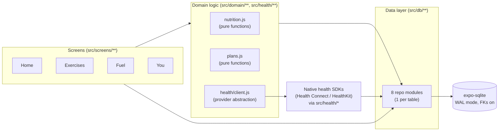

- **Navigation** is a root native-stack (`Onboarding → ProfileSetup → Main`) wrapping a bottom-tab navigator, where each of the four tabs owns its own nested native-stack. A few screens are deliberately mounted in **more than one** stack — `ProfileSetupScreen` in three, `ExerciseListScreen` in two — so that a flow like "add an exercise to today's workout" pushes and pops within the *same* stack the workout logger lives in, instead of a cross-tab jump that would leave the back button in a confusing state.
- **State management is intentionally not Redux/MobX/Zustand.** Screens hold local `useState`, refetch from SQLite on `useFocusEffect`, and treat the database itself as the single source of truth — there's no client-side cache to invalidate because there's nothing to keep in sync with a server. For a CRUD-heavy, offline-only app, that's less machinery than a global store would add, not more.
- **Plain JavaScript, consistent module boundaries.** Every screen, repo, and provider follows the same shape (a plain object or function export, no classes outside `ErrorBoundary`), so the contract between layers is enforced by convention and small, readable functions rather than a type checker (there's no separate test runner yet — see [Roadmap](#-roadmap)).

## Data Flow Walkthroughs

**Logging a set, end to end:**
`ActiveWorkoutScreen` renders one `ExerciseLogRow` per exercise in the session → typing in the weight/reps fields updates local component state only (no DB write per keystroke) → on blur (`onEndEditing`), `commit()` parses the input through `parseWeightInput()` (which also handles kg/lb conversion based on `settingsRepo.getUnits()`) and calls `workoutRepo.logSet(workoutExerciseId, weightKg, reps, existingSetId?)` → `logSet` either updates the exercise's existing set or inserts its first one and immediately marks it `completed = 1` → the screen calls `getFullSession()` again to refresh, and `getPR()` re-runs to decide whether the row should show its "New PR!" state.

**Reading today's steps on Android, end to end:**
`useHealth()`'s `sync()` calls `getHealthStatus()` → `health/client.js` lazy-loads `androidHealthConnect` (skipped entirely in Expo Go) → if Health Connect reports `granted`, `readHealth()` calls its `readToday()`, which runs Health Connect aggregate queries for steps/calories/distance/heart-rate/elevation and a `readRecords` query for sleep sessions → separately, `stepsRepo.getTodaySteps()` is checked against whatever the phone's own `Pedometer.watchStepCount` listener has accumulated → whichever step count is higher wins → the merged snapshot is persisted back into `daily_steps`/`health_daily` and rendered by `StepTrackerScreen`.

## Folder Structure

```text
GymRat/
├── App.js                        # Entry point — DB init, font loading, theme, nav root
├── app.json                      # Expo config: permissions, plugins, bundle identifiers
├── eas.json                      # EAS Build profiles (development / preview / production)
├── plugins/
│   └── withHealthConnectQueries.js   # Custom config plugin: Android manifest <queries>
├── assets/                       # Icons, splash, exercise images & bundled demo videos
└── src/
    ├── screens/
    │   ├── home/                 # Dashboard: hero, streak, protein-left, continue-workout
    │   ├── exercises/            # Library list/detail/favorites
    │   ├── fuel/                 # Nutrition targets + food logging
    │   ├── you/                  # Profile, settings, plan, custom exercises
    │   ├── workout/              # Active logger, summary, history/PRs
    │   ├── activity/             # Steps & health dashboard
    │   └── onboarding/
    ├── navigation/                # Root stack, bottom tabs, per-tab stacks
    ├── components/ui/             # Screen, AppHeader, Card, Button, Chip, EmptyState, ...
    ├── theme/                     # Colors, typography, spacing, ThemeContext
    ├── health/                    # HealthProvider interface + 3 implementations + client
    ├── db/                        # SQLite client + one repository per table
    ├── domain/                    # Pure logic: nutrition targets, training plans, profile
    ├── data/                      # exercisesData.js (97 exercises), foods.js (104 items)
    ├── hooks/                     # useHealth / useSteps
    └── utils/                     # date, units (kg⇄lb), uuid, permissions helpers
```

---

## 🚀 Getting Started

```bash
npm install
npx expo start
```

Scan the QR code in **Expo Go** to explore every screen immediately — workout logging, nutrition, the exercise library, and favorites all work out of the box. The one thing Expo Go can't do is talk to Apple Health or Health Connect (see below); it transparently uses the phone's own step sensor instead.

For full native health integration, or to run on a simulator/emulator:

```bash
npx expo run:ios       # Xcode + iOS Simulator or a device
npx expo run:android   # Android Studio + emulator or a device
```

## 🔒 Permissions & Health Data

| Environment | iOS | Android |
|---|---|---|
| **Expo Go** | Motion & Fitness only (step count via the phone's motion coprocessor) | Physical activity only (step count while the app is open) |
| **Native build** (`expo run:ios` / `expo run:android`) | Full **Apple Health** — steps, heart rate, active calories, distance, sleep, weight, workouts | Full **Health Connect** — the same metrics, aggregated from Samsung Health, Fitbit, Google Fit, etc. |

The app detects which environment it's running in and requests the correct permission automatically. Every permission string declared in `app.json` (`NSMotionUsageDescription`, `NSHealthShareUsageDescription`, the `android.permission.health.*` list) is matched exactly by the fields each provider actually requests in `src/health/`. No health data ever leaves the device.

---

## Engineering Decisions

A few deliberate tradeoffs, in case they come up:

- **No backend, no auth.** Everything is local-first by design — instant to open, works fully offline, and there's no user data sitting on a server to secure. The tradeoff is no multi-device sync; that's an explicit, current scope boundary (see [Roadmap](#-roadmap)).
- **One set per exercise, not a full set-by-set logger.** Covered in depth in [§1](#1-workout-logger-with-automatic-pr-tracking) — the schema supports more, the UI deliberately doesn't ask for it.
- **Every exercise video is a real, individually verified link — never a guessed one.** For content that doubles as safety guidance (how to perform a lift), a wrong link is a worse outcome than no link.
- **Repository pattern over an ORM.** Ten tables and eight repos is small enough that hand-written SQL stays readable, and it keeps every query auditable in one place per table.
- **No global state library.** Covered in [Architecture](#architecture) — SQLite already *is* the single source of truth; a client-side store would be a second one to keep in sync with nothing.

## 🗺 Roadmap

- [ ] Automated test suite (unit tests for `domain/nutrition.js` and `domain/plans.js` are the natural starting point — both are pure functions today)
- [ ] Wearable integration (Apple Watch, Wear OS)
- [ ] Body-weight and measurement tracking over time
- [ ] Barcode scanning for food logging
- [ ] Optional cloud backup/multi-device sync

<div align="center">

*Built by [Kush Agarwal](https://github.com/Kush172005)*

</div>
